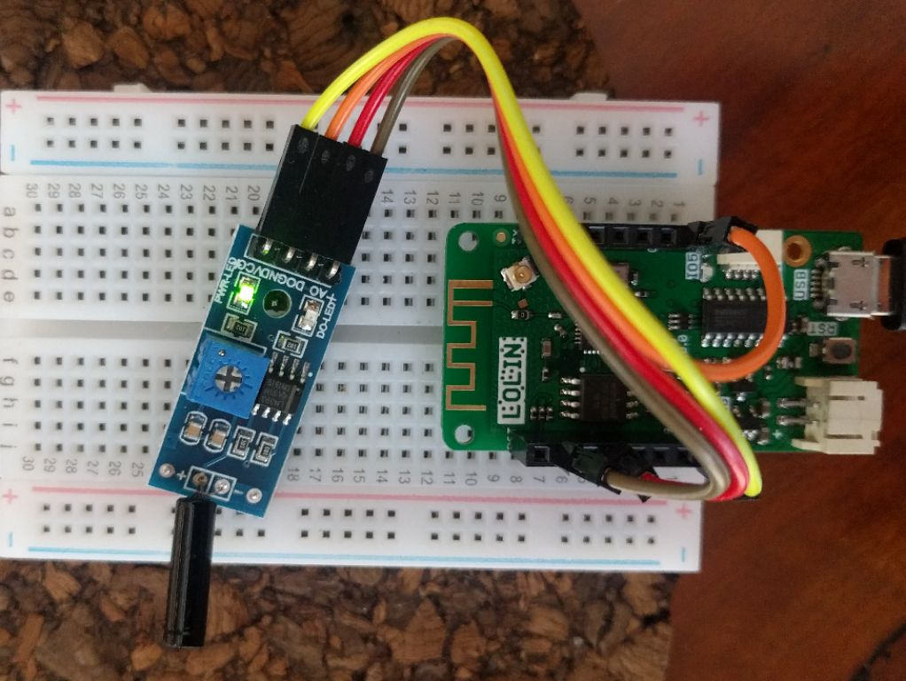
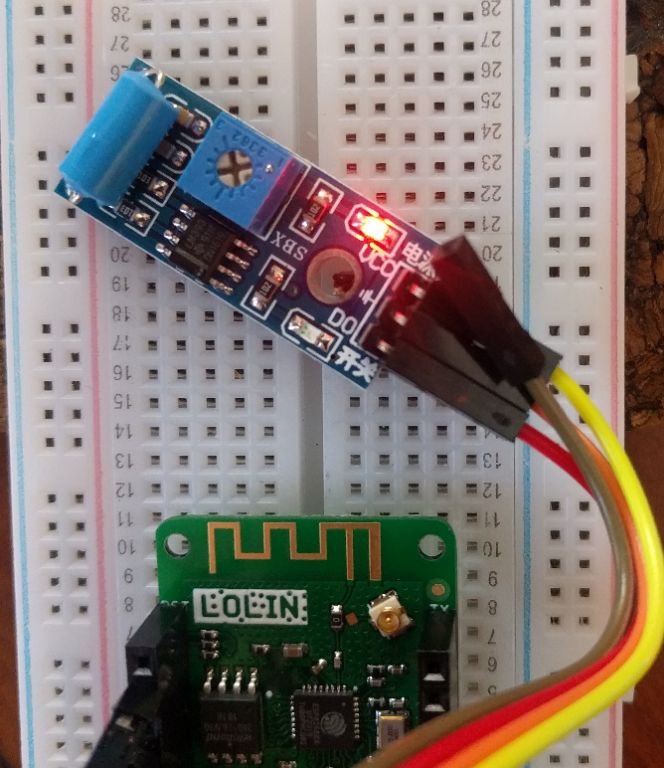

# behind_the_post_sensor

## possible sensors  
[SW-18020P](https://www.sunrom.com/p/vibration-sensor)  which comes in a decent module with analog pin.

[SW420](https://www.google.com/url?sa=t&rct=j&q=&esrc=s&source=web&cd=1&cad=rja&uact=8&ved=2ahUKEwiQ6-Lsiu_eAhVLqo8KHeYyC0cQFjAAegQIBxAB&url=http%3A%2F%2Fwww.elecrow.com%2Fvibration-sensor-module-sw420-p-525.html&usg=AOvVaw0MVLYOgY4ZCIr_TQplyyJT) is another vibration sensor

Both have been bench-tested with ESP8266 Wemos D1 mini Pro boards.

[KY-031](http://sensorkit.en.joy-it.net/index.php?title=KY-031_Knock-sensor_module) knock-sensor was discounted as not sensitive enough to vibrations.